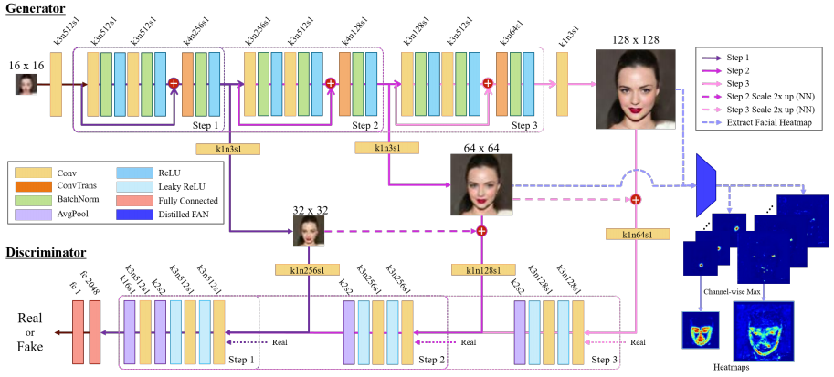

# Progressive Face Super-Resolution
Deokyun Kim, Minseon Kim, Gihyun Kwon, and Dae-shik Kim, [Progressive Face Super-Resolution via Attention to Facial Landmark](https://arxiv.org/abs/1908.08239), The British Machine Vision Conference 2019 (BMVC 2019)

## Overview


> **Progressive Face Super-Resolution via Attention to Facial Landmark**<br>
> Deokyun Kim (KAIST), Minseon Kim (KAIST), Gihyun Kwon (KAIST), et al.<br>
> **Abstract:** *Face Super-Resolution (SR) is a subfield of the SR domain that specifically targets the reconstruction of face images. The main challenge of face SR is to restore essential facial features without distortion. We propose a novel face SR method that generates photo-realistic 8× super-resolved face images with fully retained facial details. To that end, we adopt a progressive training method, which allows stable training by splitting the network into successive steps, each producing output with a progressively higher resolution. We also propose a novel facial attention loss and apply it at each step to focus on restoring facial attributes in greater details by multiplying the pixel difference and heatmap values. Lastly, we propose a compressed version of the state-of-the-art face alignment network (FAN) for landmark heatmap extraction. With the proposed FAN, we can extract the heatmaps suitable for face SR and also reduce the overall training time. Experimental results verify that our method outperforms state-of-the-art methods in both qualitative and quantitative measurements, especially in perceptual quality*.


### Prerequisites
* Python 3.6
* Pytorch 1.0.0
* CUDA 9.0 or higher

This code support [NVIDIA apex-Distributed Training in Pytorch](https://github.com/NVIDIA/apex), please follow description. 
Also, we refered state-of-the-art [Face Alignment Network](https://github.com/1adrianb/face-alignment) in order to get face SR-oriented facial landmark heatmap.

### Data Preparation

* [CelebA dataset](http://mmlab.ie.cuhk.edu.hk/projects/CelebA.html)

create a folder:

```bash
 mkdir dataset

```
and then, download dataset. Anno & Img.

#### Test model
* Test trained model
```bash
$ python eval.py --data-path './dataset' --checkpoint-path 'CHECKPOINT_PATH/generator_checkpoint_singleGPU.ckpt'
```

* Test distributed trained model
```bash
$ python -m torch.distributed.launch --nproc_per_node=number_of_used_GPUs eval.py \
                                                 --distributed \
                                                 --data-path './dataset' \
                                                 --checkpoint-path 'CHECKPOINT_PATH/generator_checkpoint.ckpt'
```


## Citation
```bash
@inproceedings{progressive-face-sr,
    author    = {Deokyun Kim, Minseon Kim, Gihyun Kwon, Dae-Shik Kim}, 
    title     = {Progressive Face Super-Resolution via Attention to Facial Landmark}, 
    booktitle = {Proceedings of the 30th British Machine Vision Conference (BMVC)},
    year  = {2019}
}
```

